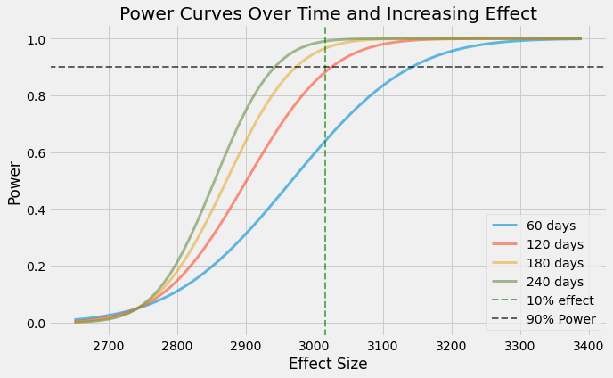
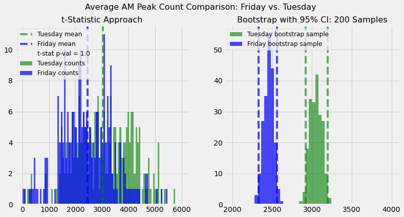

<!-- DATASCIENCE PROJECT BASIC TEMPLATE -->

<!-- 

Tips/Notices/Etc:
- If you ever want spacing, use   tags between elements 
- Use HTML where you can, it's much more malleable and offers more control than markdown. The only downside is that not all HTML features will work in github markdown
- You can use '---' inbetween sections to indicate a new section or transition, these are called thematic breaks
- Throughout the template you will see bits and pieces of different techniques and ways to align/modify/move elements using HTML

* The CLASS and ID headers are not recognized in, but rather used to clarify what the element is. When GITHUB renders readmes, it actually converts all markdown to HTML, but is extremely 'sanitized' and does not allow for scripts, class, id, etc
-->

<!-- HEADER SECTION -->

# CRANK ON SEATTLE BIKE DATA

 
<!-- Your header image here -->

    </img>

<!-- Put your badges here, either for fun or for information -->

    <!-- Project Type -->
    
    <!-- Maintained? -->
    </img>
    <!-- License? (MIT is Standard, make sure you license your project via github) -->
    
    <!-- Commit Activity? (Fill in the blanks) -->
    

 

<!-- Brief Indented Explaination, you can choose what type you want -->
<!-- Type 1 -->
> Study of bike trips in Seattle 2015 - 2019

<!-- Type 2 -->
<!-- 

    
 

 -->

 

<!-- TABLE OF CONTENTS SECTION -->
<!-- 
In page linkings are kind of weird and follow a specific format, it can be done in both markdown or HTML but I am sticking to markdown for this one as it is more readable. 

Example:
- [Title of Section](#title-of-section)
  - [Title of Nested Section](#title-of-nested-section)

## Title of Section

### Title of Nested Section

When linking section titles with spaces in between, you must use a '-' (dash) to indicate a space, and the reference link in parentheses must be lowercase. Formatting the actual title itself has to be in markdown as well. I suggest using two hashtags '##' to emphasize it is a section, leaving the largest heading (single #) for the project title. With nested titles, just keep going down in heading size (###, ####, ...)
-->

## Table of Contents

<!-- Overview Section -->
- [Overview](#overview)
  - [Context](#context)
  - [Goals](#goal)

<!-- Section 1 -->
- [Data Cleaning and Prep](#section-1)
  

<!-- Section 2 -->
- [EDA](#section-2)
- [Statistical Analysis](#section-3)
  - [Would you open a new bike shop here?](#section-3a)
  - [How 'powerful' was the increase in ride counts in 2019?](#section-3b)
  - [Taking the bike commute off--low Friday numbers](#section-3c)
<!-- Contributors -->
- [Contributors](#contributors)

<!-- Credits -->
- [Credits](#credits)

<!-- License -->
- [License](#license)

<!-- Optional Line -->
---

## Overview

### Context

<!-- Example of having image and text side by side -->

  </img>

  
 
    In 2014, the city of Seattle expanded its bike trip counter program to gain a better understanding of bike trip patterns. Sub-surface and reflective counters were placed in 12 different locations along greenways and bike commuter corridors. (Three are no longer in service and one new one was added in 2019.) The stated goal was to get a measure of baseline ridership that could guide investments in infrastructure to help the city reach its goal of increasing bike ridership by 400% by 2030. 
  

    
 
    The Crank on Seattle Bike Data project involved analyzing uploading, cleaning, and formatting this data, conducting exploratory EDA, and performing statistical tests to answer several questions that arose from viewing the dataset. 
  

  
    
    Since 2014, dedicated bike only bike lanes have been added in the city--most notably along 2nd Ave through the central district of the city. Some planned projects have been eliminated due to lack of community and government support. Seattle ranks somewhere in the middle of the top of the pack regarding bike friendliness and bike commuter ridership. According to the [2014 American Community Survey](http://bikeleague.org/sites/default/files/Where_We_Ride_2014_data_web.pdf#12) analysis of bike commuting in cities, 3.7% of people bike to work in Seattle which placed it 24th among cities with populations over 65,000.
  

  
    
    
  
    

### Goals

<!-- Example of having image and text side by side -->

  
 
    This project had several goals: What kind of patterns are recognizable in the bike rider count data that Seattle collects hourly at 9 different locations throughout the city? What can be said about the increase in ride counts from the fairly stable counts of 2018 to the increase in 2019? Is there any one ride count location that stands out as having fewer bike shops nearby (2 or 3 total) but as many ride counts as a location that has many more bike shops (5-7)? Is there any one day of the week with significantly fewer ride counts than others?
  

<!-- SECTION 1 -->
## Data Cleaning
- Datasets of hourly bike trip counts were obtained from the 10 active Seattle bike trip counter locations. While these datasets were reasonably complete and well-structured, there were several challenges to compiling them into one master datatable for useful analysis.
- The preparation of raw dataset into a usable datatable required numerous steps. The first step was to read raw files from the city of Seattle's data portals in batches and append sets from the same site into one complete set. 
- Once a location's set was complete and contained hourly bike trip counts from 1/1/2014-6/30/2020, the next steps were to create day of week, month, and year columns from the date field and then aggregate each dataset into a daily count of trips during am peak (5-9 am: assumed to be commuter trips) and other trips (an estimate of non-commuter trips: total trips - (commuter trip counts x 2)). The reason for subtracting 2x am peak counts from the total count was to allow 'other trip counts' to be a proxy for recreational trip counts. 
- A column with the count of bike shops within approx 2 miles of the bike trip counter location was added for each of the 9 bike trip counter locations.
- Each of the 9 bike trip counter location files were then merged by date into one master. Daily weather for Seattle (sourced by NOAA) info was added.
- Additional columns were then created on this master datatable:
>
> - Total am peak trips and other trips
> - Summary columns of am peak trip counts (and other trip counts) for counter locations with 'fewer' bike shops nearby (3 or less) and 'many' bike shops nearby (4 or more)

<!-- SECTION 2 -->
## EDA
- This data has its limitations. The bike count--while daily--is by no means a comprehensive count of bike trips. Nor do these counts tell us anything about why people choose to ride or why others choose not to. Also, riders on a single trip could be counted at more than one location if their trip happened to pass by multiple counter locations. The likelihood of this happening increases with longer trips since more counters could be encountered, and with certain commuter trips since counters are located at the heads and tails of common commutes such as Fremont and downtown.
- During EDA, it was discovered that one of these sites did not come online until 2019. This site was not included in any of the analysis. Nine sites were included in the analysis.
- During EDA, it was discovered that data from several of the counter locations during 2014 was unreliable. Counts were 2-3x expectations. All data from this year was dropped.
- 2020 has been such an anomaly that it too was dropped from analysis. It may be interesting to perform analysis on data from this year at a future date.
- During EDA, it was discovered that data from the NE Seattle counter location was missing for 3 months in the summer. Counts were much higher than expected in the month prior suggesting that this month's totals may have actually included some of the missing data, but clearly not all of it. Entries for these four months were converted to NaN values so as to maintain the integrity of statistics and data visualization.
- Numerous preliminary visualizations were performed to better understand some of the patterns in the data. At a top level, daily ride counts were separated out between am peak commuter times and other times. These two groups were mostly analyzed separately since they demonstrated different patterns of weekly cyclicity, monthly seasonality 

> - Bike trip counts during the am peak were lower than bike trip counts at other times of the day and lower than anticipated.

   </img>

   </img>

> - Bike trip counts exhibit a strong seasonal pattern--less so for am peak commuter trip counts and more so for counts from other times of day.

   </img>

> - AM peak (weekday only) bike trip counts exhibit a pattern by day of week. Trip counts peak on Tuesday and Wednesday and are lowest on Friday. A comparison is presented in the Statistics section.

   </img>

> - Non-AM peak bike trip counts peak on weekends and are consistent other days of the week.

   </img>

> - Bike trip counts did not increase from 2015-2018. Bike trip counts increased more than 15% in 2019. Counts increased 70% at the downtown 2nd Avenue location alone, which coincided with the completion of a dedicated bike-way in 2018. This led to a question about statistical power curves which will be discussed in the Statistics section.

   </img>

>
> - Counts were more than twice as high at locations which had 5 or nearby bike shops than at locations with 2-3 bike shops nearby. The variation within these groups was high, so further analysis was done to compare the location from the 'fewer' bike shops group with the most average rides to the 'more' bike shops group. That analysis is discussed in the Statistics section.
> - Sites with fewer (2-3) bike shops include Myrtle Edwards, West Seattle, Spokane Street, Ballard, and Capitol Hill.
> - Sites with more (5-8) bike shops include Fremont, 2nd Avenue downtown, NE Seattle, and the I-90 lid. 

   </img>

<!-- SECTION 3 -->
## Statistical Analysis

  <!-- SECTION 3A -->
### Would you open a new bike shop here?
  

  
 
    One reasonable question from this dataset would be to ask if any of the locations might have favorable attributes to siting a new bike shop. In particular, it might be interesting if a location had few bike shops but ride counts that were comparable to locations with more bike shops.
   

 
  
    During the EDA it was discovered that locations with fewer bike shops nearby coincided with lower ride counts than locations with more bike shops. Since the variation within these groups was high, statistical analysis was done to compare the location from the 'fewer' bike shops group with the highest average ride count to the 'more' bike shops group. This location was Myrtle Edwards. It has two bike shops nearby. Counts average 850 rides per day. This compares to an average of 950 for ride counts from the 'more' bike shops group.
  

  
 
-    The null hypothesis: Myrtle Edwards ride counts are less than those in the 'more' group. 
-    Alternative hypothesis: Myrtle Edwards ride counts are as good as or better than those in the 'more' group. 
-    A t-test was chosen to compare the means. The alpha level was set at 0.05, but needed to be adjusted since the data was viewed prior to the site selection. Since the 'fewer' group had 5 members in it and all 5 of them could have been selected, the alpha needed to be divided by 5 to reduce the observor error from hand-selecting the site most likely to exceed the alpha level.
    - Result: Unfortunately, the p-value was very low meaning that the null hypothesis could not be rejected. While Myrtle Edwards does have high ride counts compared to its peers, the alternative hypothesis could not be accepted.
  

   </img>

  

  <!-- SECTION 3B -->
### How 'powerful' was the increase in ride counts in 2019?
  

  
 
    The city of Seattle wrapped up its most expensive bike transit improvement in history in 2018 with the completion of a separated bikeway through downtown on Second Avenue. This raised a hypothetical question. If we were working for the city of Seattle in 2018 and were planning to publicize the success of the new bikeway, when should we have our Public Relations team prepare the media event? 
  

  
 
    On the one hand, we'd want to avoid the embarassment of claiming success when there wasn't really a success, so we'd want a reasonably strict alpha level. But we'd also want to predict the earliest opportunity to accept the alternative hypothesis given the alternative hypothesis is true and not delay promoting our success. A power curve analysis would provide some answers.
  

  
 
    Consider every day to be a sample. If we just look at AM peak trips, we get about 60 samples every quarter. If we choose an alpha level of 0.05, what do the power curves look like as sample sizes and effect rate change? If we assume that we will see a 10% increase in ride counts, when will we have a 90% chance of accepting the alternative hypothesis?
  

   </img>

  

  <!-- SECTION 3C -->
### Taking the bike commute off--low Friday numbers
  

  
 
    Is there really something down about Fridays? It looks like it has the lowest average counts in both the 'am peak' bike count group and 'other' group. Is this apparent difference statistically meaningful? This question was looked at two ways. The first approach was with a t-test approach comparing Tuesday average counts during the am peak to Friday average counts during the am peak. The next approach relied on a bootstrap analysis technique of repeatedly resampling the samples to estimate the distribution of the sample means. Bootstrap samples were derived for the Tuesday and Friday groups and 95% confidence intervals were generated for each. 
  

  
 
    The alpha level was set to 0.05 for the t-test. The null hypothesis was that the means were the same. The alternative hypothesis was that the Tuesday group had a higher mean. The p-value approached zero--we could accept the alternative hypothesis. The bootstrap confidence intervals did not come close to overlapping.
  

   </img>

  

<!-- Another line -->
---

## Contributors
[Rob Salvino](https://github.com/salvir1)

## License
[MIT ©](https://choosealicense.com/licenses/mit/)

